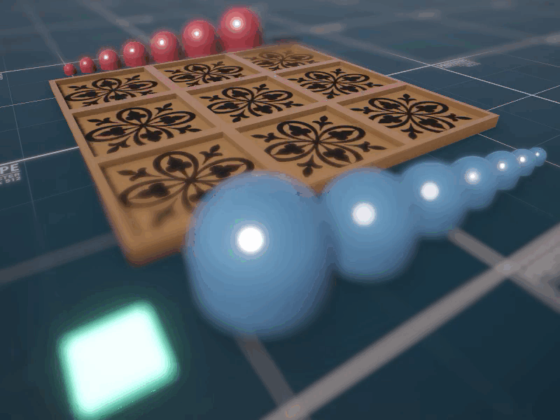
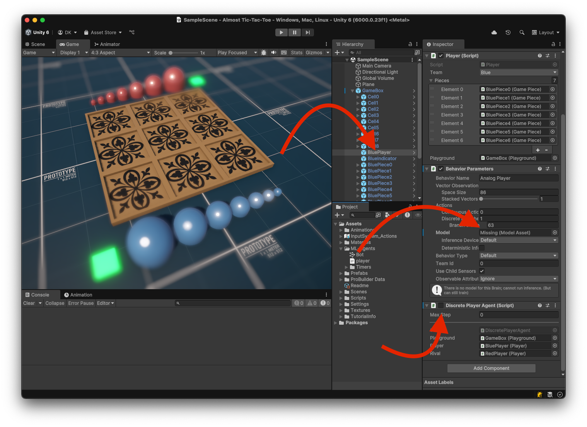

# Gobblet Gobblers implemented in Unity 6 with ML-Agents

A Unity implementation of the classic strategy game **Gobblet Gobblers**, enhanced with **ML-Agents** to train an AI capable of playing competitively.

## Game Overview

Gobblet Gobblers is a twist on traditional Tic-Tac-Toe. Played on a **3x3 grid**, it adds strategic depth through the use of **nested pieces** of varying sizes — think *matryoshka dolls*.

Each player controls **7 stackable pieces**, from small to large.

### Rules of the Game

- On their turn, a player can:
  - **Place** a piece on an empty cell.
  - **Cover** any existing piece (even an opponent's) with a **larger** one.
- A player **wins** by aligning **three visible pieces** of their own in a straight line — horizontally, vertically, or diagonally.

Covered pieces can re-emerge later, so bluffing and memory play a key role!

---

### 🤖 AI Training with ML-Agents

This project uses Unity ML-Agents to train neural networks to play the game effectively, learning strategies beyond brute-force.

---

### 🕹️ How to Play

By default, the **red player** is controlled by a **simple trained model**, while the **blue player** can be played **manually** by dragging pieces with the mouse.

If you'd like the AI to control **both players**, follow these steps:

1. Select the `BluePlayer` object in the Unity scene.
2. Assign a trained model to its **Behavior Parameters** component (as shown in the screenshot).
3. Enable the **Discrete Player Agent** component.

Enjoy the game and feel free to explore the code!

---

### 💬 Notes

At the moment, I haven't spent much time optimizing the training process — just enough to make the red-side AI functional. If you have ideas on how to **train the model more effectively**, feel free to share! I'd really appreciate any insights. 🙂
