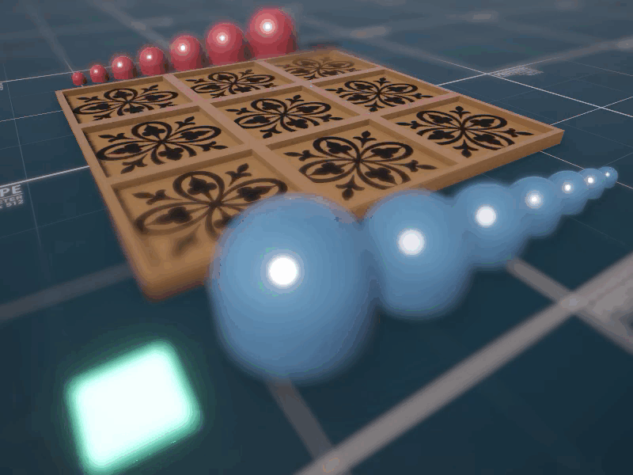

# Gobblet Gobblers in Unity with ML-Agents

A Unity implementation of the classic strategy game **Gobblet Gobblers**, enhanced with **ML-Agents** to train an AI capable of playing competitively.

## Game Overview

Gobblet Gobblers is a twist on traditional Tic-Tac-Toe. Played on a **3x3 grid**, it adds strategic depth through the use of **nested pieces** of varying sizes — think *matryoshka dolls*.

Each player controls **7 stackable pieces**, from small to large.

### Rules of the Game

- On their turn, a player can:
  - **Place** a piece on an empty cell.
  - **Cover** any existing piece (even an opponent's) with a **larger** one.
- A player **wins** by aligning **three visible pieces** of their own in a straight line — horizontally, vertically, or diagonally.

Covered pieces can re-emerge later, so bluffing and memory play a key role!

---

### 🤖 AI Training with ML-Agents

This project uses Unity ML-Agents to train neural networks to play the game effectively, learning strategies beyond brute-force.

---
